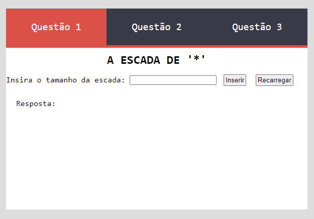
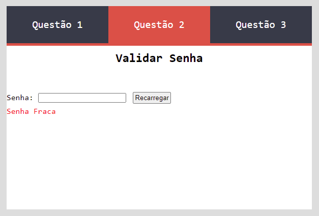

# Desafio Capgemini 2022

Os exercícios foram desenvolvidos utilizando as tecnologias:
- Javascript;
- HTML;
- CSS.

## Como visualizar as soluções?

Basta realizar o [**download**](https://github.com/netoivony/desafio_capgemini2022/archive/refs/heads/main.zip) e abrir o arquivo index.html com seu navegador padrão.

## Questão 1

## Questão 2

